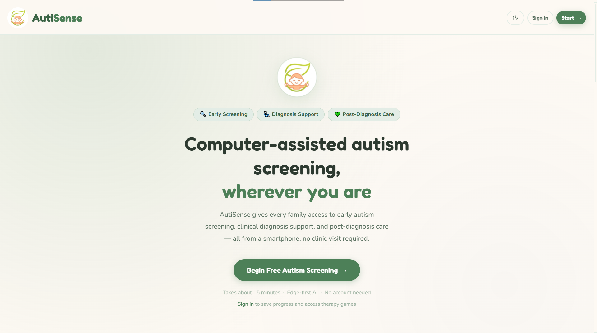

<div align="center">


# AutiSense

### Privacy-first, in-browser AI screening for autism-related repetitive motor movements

Your video never leaves your device. The pose and behavior analysis runs locally in your browser.

[**Open the web app →**](https://autisense.imaginaerium.in) &nbsp;·&nbsp; [Download installers](https://github.com/Partha-dev01/AutiSense/releases) &nbsp;·&nbsp; [Docs](docs/) &nbsp;·&nbsp; [By Imaginaerium](https://imaginaerium.in)

[](https://nextjs.org/)
[](https://react.dev/)
[](https://www.typescriptlang.org/)
[](https://onnxruntime.ai/)
[](#-download--install)

<br clear="left" />



</div>

---

> [!IMPORTANT]
> ### ⚠️ Not a medical or diagnostic tool
> AutiSense is a **screening and educational aid only**. It is **not** a diagnostic
> device, and it has **not** been clinically validated. It cannot diagnose autism or
> any other condition, and its results must never replace assessment by a qualified
> clinician. The on-device models flag behavioral patterns that should be
> interpreted by a professional. If you have concerns about a child's development,
> please consult a healthcare provider. See [Ethics & privacy](#-ethics--privacy).

---

## 📑 Table of contents

- [What it is](#-what-it-is)
- [Key features](#-key-features)
- [Screenshots](#-screenshots)
- [Use the web app](#-use-the-web-app)
- [Download & install](#-download--install)
- [Tech stack](#-tech-stack)
- [Architecture overview](#-architecture-overview)
- [Local development](#-local-development)
- [Build & release](#-build--release)
- [Project structure](#-project-structure)
- [Documentation](#-documentation)
- [Contributing](#-contributing)
- [Ethics & privacy](#-ethics--privacy)
- [Credits](#-credits)

---

## 🧩 What it is

AutiSense helps parents, caregivers, and educators **understand repetitive motor
movements** (stereotypies) such as hand-flapping, body-rocking, spinning, and
toe-walking. Using a device camera, the app runs an on-device computer-vision
pipeline that estimates body pose and classifies the observed movement over a
short time window, and pairs it with a guided activity flow.

The defining trait of AutiSense is **privacy by architecture**: the screening
inference — pose estimation and behavior classification — runs **fully
client-side in the browser** using ONNX Runtime Web. Raw video frames are never
uploaded. Cloud features (e.g. generating a written report, text-to-speech) are
opt-in and have graceful offline/template fallbacks.

The same web app is wrapped as installable apps for desktop and Android (see
[Download & install](#-download--install)), all of which are **thin clients** that
load the live site — so a single web deploy updates every platform at once.

---

## ✨ Key features

- 🔒 **On-device screening inference** — pose + behavior models run in your browser
  via ONNX Runtime Web (WebGPU with a WASM fallback), inside a Web Worker. Video
  stays on your device.
- 🕺 **Pose-based movement screening** — a YOLO pose model extracts COCO-17 body
  keypoints; a Temporal Convolutional Network (TCN) classifies a 64-frame window
  into movement categories.
- 🧒 **Guided intake flow** — a multi-step activity sequence (consent, device
  check, communication, motor/reaction tasks, and behavioral video capture).
- 🎮 **Kids dashboard** — therapy-style games, a supportive AI chat with animal
  avatars, speech practice, progress tracking, and a nearby-help map.
- 📝 **Plain-language reports** — optionally generate a readable session summary
  and a downloadable PDF (server-side, via AWS Bedrock; template fallback when
  offline).
- 🔊 **Text-to-speech** — AWS Polly with a browser `speechSynthesis` fallback.
- 🗺️ **Nearby support lookup** — find relevant places via OpenStreetMap/Overpass.
- 📱 **Installable everywhere** — Progressive Web App (PWA) plus packaged apps for
  Windows, macOS, Linux, and Android.
- 🗄️ **Local-first storage** — profiles, sessions, biomarkers, game progress, and
  streaks live in IndexedDB (Dexie). Opt-in, anonymized cloud sync is available.
- 🛡️ **Hardened security posture** — per-request nonce CSP, COOP/COEP cross-origin
  isolation, HSTS, Google OAuth with PKCE, and self-hosted fonts + ONNX runtime.

---

## 📸 Screenshots

The landing page is shown at the top of this README.

> **TODO (maintainer):** add more screenshots / a short GIF. Suggested shots: the
> live detection screen with the pose overlay, the intake flow, and a generated
> report. Place new images under `docs/assets/` and reference them with relative
> links, e.g. ``.

---

## 🌐 Use the web app

No installation required — the app runs in any modern browser:

**👉 https://autisense.imaginaerium.in**

You can also **install it as a PWA**: open the site in Chrome/Edge (desktop or
Android) or use *Add to Home Screen* on iOS Safari, and choose **Install**. The
PWA runs full-screen with an offline app shell.

> A camera is required for the screening features. The browser will ask for camera
> permission; it is used only for on-device analysis.

---

## ⬇️ Download & install

Native apps are published on the
[**Releases**](https://github.com/Partha-dev01/AutiSense/releases) page. The
latest is **[v1.2.2](https://github.com/Partha-dev01/AutiSense/releases/tag/v1.2.2)**.

| Platform | File | Notes |
|---|---|---|
| 🪟 Windows | `AutiSense-Setup-1.2.2.exe` | NSIS installer |
| 🐧 Linux | `AutiSense-1.2.2.AppImage` | Portable, no install |
| 🐧 Linux | `autisense-desktop_1.2.2_amd64.deb` | Debian/Ubuntu package |
| 🍎 macOS | `AutiSense-1.2.2-arm64.dmg` | **Apple Silicon (arm64) only** |
| 🤖 Android | `app-release-signed.apk` | Sideload (`.aab` also available for Play) |

> [!NOTE]
> **All installers are currently unsigned** (no paid code-signing certificates
> yet), so your OS will likely show a security warning on first open. The steps
> below are safe and only needed once. Full troubleshooting lives in
> [`docs/INSTALL.md`](docs/INSTALL.md).

### 🪟 Windows
1. Run `AutiSense-Setup-1.2.2.exe`.
2. If **Windows SmartScreen** appears, click **More info → Run anyway**.
3. Follow the installer.

### 🍎 macOS (Apple Silicon)
Because the app is unsigned and downloaded from the internet, macOS Gatekeeper
puts it in *quarantine*, which on Apple Silicon often shows
**"App is damaged and can't be opened."** This is expected for an unsigned
download — not actual damage.

1. Open the `.dmg` and drag **AutiSense** into **Applications**.
2. Open **Terminal** and clear the quarantine attribute:
   ```bash
   xattr -cr /Applications/AutiSense.app
   ```
3. Launch AutiSense from Applications.
4. If it still refuses to open, ad-hoc sign it locally:
   ```bash
   codesign --force --deep --sign - /Applications/AutiSense.app
   ```

> **Why:** Gatekeeper blocks unsigned, quarantined downloads. The proper future
> fix is an Apple Developer ID certificate + notarization. See
> [`docs/INSTALL.md`](docs/INSTALL.md#macos).

### 🐧 Linux
**AppImage** (portable):
```bash
chmod +x AutiSense-1.2.2.AppImage
./AutiSense-1.2.2.AppImage
```
**Debian/Ubuntu (.deb):**
```bash
sudo dpkg -i autisense-desktop_1.2.2_amd64.deb
```

### 🤖 Android
1. Download `app-release-signed.apk` to your device.
2. Allow **install from unknown sources** for your browser/file manager when
   prompted.
3. Open the APK to install.

> The Android app is a **Trusted Web Activity (TWA)** that opens the live PWA
> full-screen via your device's Chrome engine. Digital Asset Links verify the
> domain so there is no browser address bar (it falls back to a Custom Tab with a
> URL bar if verification doesn't pass).

---

## 🛠️ Tech stack

| Area | Technology |
|---|---|
| Framework | Next.js 16 (App Router), React 19, TypeScript 5 |
| Styling / UI | Tailwind CSS v4, lucide-react icons, Recharts, Leaflet |
| On-device ML | ONNX Runtime Web 1.24 (WASM + WebGPU), YOLO pose model, TCN classifiers |
| Face/pose tooling | `@mediapipe/tasks-vision` |
| Local storage | Dexie (IndexedDB) |
| Auth | Google OAuth 2.0 (PKCE, `S256`), HTTP-only session cookie |
| Server (API routes) | AWS SDK v3 — DynamoDB, Bedrock, Polly |
| Generative AI | AWS Bedrock (Amazon Nova Lite + Nova Pro) |
| Text-to-speech | AWS Polly (Neural) |
| PDF / sanitization | pdf-lib, DOMPurify |
| Hosting | AWS Amplify (WEB_COMPUTE / SSR) |
| Desktop clients | Electron + electron-builder + electron-updater (thin client) |
| Android client | Trusted Web Activity (Bubblewrap) |
| Testing | Vitest (unit), Playwright (E2E) |

The ONNX runtime WASM assets and web fonts are **self-hosted** to satisfy a strict
CSP and avoid third-party runtime requests.

---

## 🏗️ Architecture overview

AutiSense is **one web app, many thin shells**. The Next.js app hosted on AWS
Amplify is the single source of truth; the desktop and Android packages bundle
no application code — they just load `https://autisense.imaginaerium.in`.

```
                    ┌─────────────────────────────────────────────┐
                    │  AutiSense web app (Next.js on AWS Amplify)  │
                    │                                              │
   In browser:      │  • App Router pages + API routes             │
   ONNX pipeline    │  • Client-side ONNX inference (pose + TCN)   │
   (pose + TCN)     │  • IndexedDB (Dexie) local-first storage     │
   runs on device   │  • API routes: Bedrock / Polly / DynamoDB    │
                    └───────▲───────────────▲───────────────▲──────┘
                            │               │               │
                  loads the live site (no bundled app code)
                            │               │               │
            ┌───────────────┴──┐   ┌────────┴───────┐   ┌───┴────────────┐
            │ Electron desktop │   │ Android TWA    │   │ Browser / PWA  │
            │ (Win/macOS/Linux)│   │ (Chrome engine)│   │ (installable)  │
            └──────────────────┘   └────────────────┘   └────────────────┘
```

**Why thin clients?** One deploy updates every platform, there are no stale
bundles, the same hardened security headers apply everywhere, and the installers
stay tiny. (The Electron and TWA wrappers add only shell concerns — camera
permissions scoped to the app origin, external links to the system browser, a
desktop Google-OAuth deep-link hand-off, and self-update.)

**On-device inference pipeline:** a YOLO pose model produces COCO-17 keypoints
per frame → an engineered per-frame feature vector → a 64-frame temporal buffer
fed to a TCN that outputs movement-class probabilities. Backend selection prefers
WebGPU and falls back to multi-threaded WASM (which is why COOP/COEP cross-origin
isolation is enabled — it unlocks `SharedArrayBuffer`).

For a deeper dive, see [`docs/ARCHITECTURE.md`](docs/ARCHITECTURE.md).

---

## 💻 Local development

> Requires **Node.js 22+** (see `.nvmrc`) and npm.

```bash
git clone https://github.com/Partha-dev01/AutiSense.git
cd AutiSense
npm install
cp .env.local.example .env.local   # then fill in your own values
npm run dev                         # http://localhost:3000
```

Environment variables are documented in
[`.env.local.example`](.env.local.example) and explained in
[`docs/DEVELOPMENT.md`](docs/DEVELOPMENT.md). The AWS-backed features (reports,
TTS, assistant, sign-in, sync) need their respective credentials/resources, but
each API route has a graceful fallback — the app runs without AWS, and the
on-device screening pipeline works regardless.

### Scripts

| Script | What it does |
|---|---|
| `npm run dev` | Start the dev server |
| `npm run build` | Production build |
| `npm run start` | Serve the production build |
| `npm run lint` | ESLint |
| `npm run type-check` | TypeScript (`tsc --noEmit`) |
| `npm run test:unit` | Vitest unit tests (see caveat below) |
| `npm test` | Playwright E2E tests |

> [!WARNING]
> **Test-runner path caveat:** Vitest can fail to start if the project lives
> under a directory whose path contains a `#` character (a known tooling issue).
> If you hit this, move/clone the repo to a path without `#`, or rely on CI,
> which checks out to a clean path. Details in
> [`docs/DEVELOPMENT.md`](docs/DEVELOPMENT.md).

---

## 📦 Build & release

The native apps are **thin clients** built from the `electron/` and `twa/`
subfolders. They wrap the live site, so they don't depend on the Next.js build.
GitHub Actions workflows under `.github/workflows/` drive CI and the desktop /
Android release builds.

- **Desktop (Electron):** `cd electron && npm install && npm run dist:win`
  (or `dist:mac` / `dist:linux`). Each OS target must build on its own OS; CI uses
  a Windows/Ubuntu/macOS matrix. App icons go in `electron/build/`.
- **Android (TWA):** built with Bubblewrap from `twa/twa-manifest.json`
  (`bubblewrap build`). Signed artifacts require the release keystore, which is
  **not** in the repo, plus a matching SHA-256 fingerprint in
  `public/.well-known/assetlinks.json`.

Installers are currently unsigned. See [`docs/INSTALL.md`](docs/INSTALL.md) for
why and what users must do, and the per-platform READMEs in
[`electron/`](electron/README.md) and [`twa/`](twa/README.md).

---

## 🗂️ Project structure

```
AutiSense/
├── app/                      # Next.js App Router
│   ├── api/                  # Server routes: auth, chat, feed, health, nearby, report, sync, tts
│   ├── components/           # Shared UI components
│   ├── contexts/ · hooks/    # Auth context + React hooks (camera, inference, theme, auth)
│   ├── lib/                  # Auth, AWS, Dexie repos, scoring, utilities
│   │   └── inference/        # ONNX pipeline: YOLO + TCN(s), feature encoders, orchestrators
│   ├── dashboard/            # Clinician dashboard + child profiles
│   ├── kid-dashboard/        # Kids hub: games, chat, speech, progress, reports, nearby-help
│   ├── intake/               # Guided multi-step screening flow
│   ├── games/                # Therapy-style games
│   └── feed/ · auth/         # Community feed + login
├── workers/                  # ONNX inference Web Worker
├── public/
│   ├── models/               # Self-hosted ONNX models
│   ├── ort/                  # Self-hosted ONNX Runtime Web WASM assets
│   └── .well-known/          # assetlinks.json (Android TWA verification)
├── electron/                 # Desktop thin client (Electron)
├── twa/                      # Android thin client (Trusted Web Activity)
├── server/                   # Lambda handler + DynamoDB setup script
├── docs/                     # Documentation
├── middleware.ts             # Per-request nonce CSP
├── next.config.ts            # Security headers, caching, build config
└── amplify.yml               # AWS Amplify build spec
```

---

## 📚 Documentation

| Document | Contents |
|---|---|
| [`docs/INSTALL.md`](docs/INSTALL.md) | Full per-platform install + unsigned-app troubleshooting |
| [`docs/ARCHITECTURE.md`](docs/ARCHITECTURE.md) | Web app, on-device pipeline, thin clients, data flow |
| [`docs/DEVELOPMENT.md`](docs/DEVELOPMENT.md) | Local setup, scripts, env vars, the `#`-path test caveat |
| [`docs/SECURITY.md`](docs/SECURITY.md) | CSP/headers/privacy posture + how to report issues |
| [`docs/DOCS.md`](docs/DOCS.md) | In-depth project reference (features, pipeline, data, APIs) |
| [`docs/SETUP_GUIDE.md`](docs/SETUP_GUIDE.md) | Deployment reference (AWS resources, env vars) |
| [`docs/Amazon_usage.md`](docs/Amazon_usage.md) | AWS architecture (Bedrock, Polly, DynamoDB, Amplify, IAM) |

---

## 🤝 Contributing

Contributions are welcome! Please read [`CONTRIBUTING.md`](CONTRIBUTING.md) for
the workflow, coding standards, and the test-path caveat. A few ground rules:

- Keep changes accurate and honest — this is a medical-adjacent project; never
  overstate capabilities.
- Don't commit secrets. `.env*` files are gitignored.
- Run `npm run lint` and `npm run type-check` before opening a PR.

---

## 🔐 Ethics & privacy

AutiSense is built privacy-first and is deliberately conservative about claims:

- **Not a diagnosis.** AutiSense is a screening/educational aid. It is not a
  medical device and has not been clinically validated. It must never be used as
  a substitute for professional assessment.
- **No accuracy claims.** We do not advertise model accuracy as a selling point.
  Movement classification is imperfect and can be wrong; treat output as a prompt
  for further observation, not a verdict.
- **Your video stays on your device.** Screening pose estimation and behavior
  classification run entirely in your browser. Frames are not uploaded.
- **Local-first data.** Profiles, sessions, biomarkers, and game progress are
  stored in your browser's IndexedDB. Server interaction happens only for features
  you opt into (e.g., report generation or anonymized cloud sync). A "delete my
  data" control is provided.
- **Hardened by default.** Strict CSP with per-request nonces, cross-origin
  isolation (COOP/COEP), HSTS, OAuth with PKCE, and self-hosted assets.

Read more in [`docs/SECURITY.md`](docs/SECURITY.md) and the in-app legal pages.
To report a security or privacy issue, see
[`docs/SECURITY.md`](docs/SECURITY.md#reporting-a-vulnerability).

---

## 🙏 Credits

Built by **[Imaginaerium](https://imaginaerium.in)**.

- Live app: https://autisense.imaginaerium.in
- Repository: https://github.com/Partha-dev01/AutiSense
- About the team: https://imaginaerium.in

> **License:** see the [`LICENSE`](LICENSE) file in the repository root.
